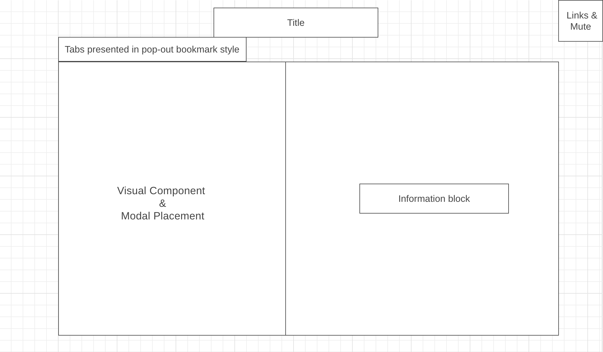

# Boblin's Adventurer's Guide

[Boblin's Adventurer's Guide](https://jtabor214.github.io/boblins_adventurers_guide/) is a data visualization containing information on the rules and statistics for the 5th edition of Dungeons & Dragons by Wizards of the Coast. This guide is designed to provide players with quick access to all relevant information found within the multiple modules spanning D&D's vast library. This includes information on topic such as playable Races, Classes, Backgrounds, and Feat choices. This guide is designed to be intuative for all players, regardless of experience, by displaying the information in organized tabs leading to easy-to-digest snippets of information. The intentional organization of information on the application also follows the natural progression a player takes when designing a character.

## Functionality & MVPs:

After data was successfully fetched from the API, each dataset would then be passed to initiate an instance of the class specified within the event listener. The class would then take the newly rendered json information and two iterative functions handled how that data would then be sectioned out and formatted. 

Information rendered on the left side of the application contained the following code: 
```js
  populateRaceDOM(data){
	  const raceList = document.getElementById('visualContainer');
    const list = document.createElement('ul');
		list.classList.add('raceNames');

    data.results.forEach(race => {
      
      const raceDiv = document.createElement('div');
      const raceEle = document.createElement('button');
      raceEle.classList.add('name');
      raceEle.textContent = race.name;

      const image = document.createElement('img');
      image.classList.add("race-image");
      image.src = `./assets/characters/${race.name.replace(/-/g, '').toLowerCase()}.png`;

      raceDiv.appendChild(image);
      raceDiv.appendChild(raceEle);

			raceEle.addEventListener('click', ev => {
				renderRaceDesc(ev, race);
			});
      list.appendChild(raceDiv);
    
    });

		raceList.innerHTML = '';
    raceList.appendChild(list);
  };
}
```
In this snippet, each race name was rendered alongside its matching image asset that existed locally. Once formatted, the button created served the purpose of rendering the desired information to the container set directly to the right of it:

```js
const renderRaceDesc =  (ev, race) => {
  const raceInfo = document.getElementById('dataContainer');
  const list = document.createElement('ul');
  const targetInfo = [race.desc, race.size, race.traits, race.vision];


  targetInfo.forEach(info => {
    const raceStats = document.createElement('p');
    raceStats.innerHTML = marked.parse(info);
    list.appendChild(raceStats);
  });
  

  raceInfo.innerHTML = '';
  raceInfo.appendChild(list);

};
```

### Within the 5e Player Toolkit:

* Users are able to choose from a selection of topics on the Navigation Bar by clicking on the appropriate tab. In response, the application will fetch the relevant information from an API and will present the proper information regarding the topic chosen.

* Tabs include: Races, Classes, Backgrounds, and Feats

* Visual aspects that accompany certain information blocks

## Wireframe: 



## Technologies, Libraries, API's 
* Marked Library
* Playground AI
* Reroll

### All of the following technologies make up this project: 

* The Dungeons and Dragons OpenAPI: [https://api.open5e.com/]. 
* Webpack to bundle and transpile the source JavaScript code.
* npm to manage project dependencies.
* HTML and CSS to structure and style the application.

## Implementation Timeline

* Friday Afternoon & Weekend: Complete the necessary set up requirements to get the project running--including the webpack. Create tabs and ensure fetching information is working appropriately. Ensure tabs work properly and that the applications functionality operates at its expected level.

* Monday: Ensure that fetched information is spaced and presented appropriately, close to its final position on the page.

* Tuesday: Finalize visualization ideas and the rendering of desired images. Begin animation processes for desired visuals. 

* Wednesday: Have all visualizations and styling finished. Tie up any remaining loose ends.

* Thursday: Deploy to GitHub.
